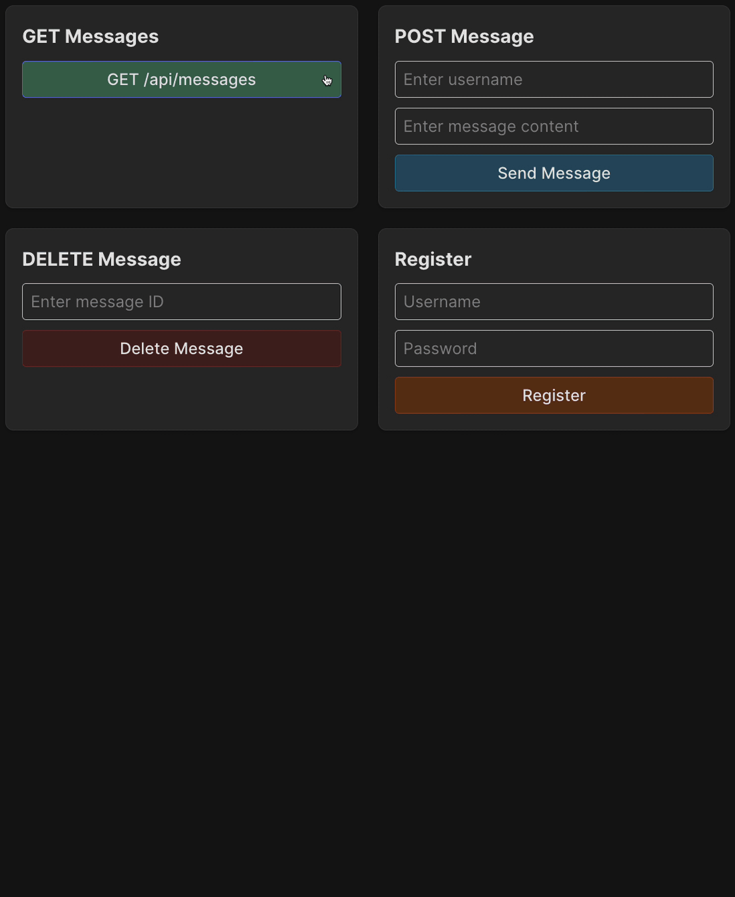

Adding authentication is not a difficult process, but we will need to make changes in several parts of the project, so we will do it step by step.

1. We need to implement a method for generating token and middleware to check the token in user requests. Let's call it auth middleware.
   We discussed the [middleware concept](course://TestingDebugging/middleware_concept) before, and it is perfect for user authorization.
2. Update the `'/login'` and `'/register'` routes to return a token to the user upon successful login or registration.
3. Add auth middleware for `'/api/messages'` requests.

The frontend adds a token to the headers of every request it sends, which can be used by the backend to authenticate the user.

### Task
#### Auth middleware
Take a look at the `backend/src/middleware/auth.js` file.
To generate a token, we need a secret key from the `.env` file.
The simplest way to get it is to use the `dotenv` library.
It automatically loads environment variables from the `backend/.env` file and gives us access to them via `process.env.ENV_NAME`.

1. Retrieve the `JWT_SECRET` environment variable and save it in a variable with the same name.
2. Since the secret key is critical for the app to work, if this variable is missing, log an error message using `console.error` and 
  terminate the backend with the `process.exit(1)` method. Come up with the error message yourself.
3. To generate a token in the `generateToken` function, use the `jwt.sign` method, passing the payload 
  (in our case, `{username}`) and `JWT_SECRET` as arguments. The `jwt.sign` method can also accept options 
  like the token's expiration time as a third parameter. Learn more about the method [here](https://www.npmjs.com/package/jsonwebtoken#jwtsignpayload-secretorprivatekey-options-callback).
4. In the `authenticateRoute` method, retrieve the token from the request headers: `req.headers['authorization']`.
5. If the token is missing, terminate the request with a `401` status code and an error message (come up with it yourself).
6. Use the method `jwt.verify(token, JWT_SECRET)` (learn more about it [here](https://www.npmjs.com/package/jsonwebtoken#jwtverifytoken-secretorpublickey-options-callback)) 
  to retrieve the payload from the token.
7. Then, use the `userService.getUser` method to check if the user exists in the system.
8. If the user does not exist, terminate the request with a `401` status code and an error message (come up with it yourself).
9. If the user exists, save the username in the `req.username` property. We will use this later.
10. Finally, make sure to call the `next()` method so that the request can continue to the next middleware or route handler in the processing chain.

#### Update auth router
Now open the `backend/src/routes/auth.js` file.

Here we need to update the `'/login'` and `'/register'` routes so that they generate a token using the `generateToken` function and pass it to the client.  
Now the JSON response for successful registration or login will look like this: `{ token: <token>, username: <username> }`.

#### Protect messages
We are almost done; just one small change remains in the `backend/src/index.js` file.

Here we need to add auth middleware for the `messageRoutes` router. This is very simple: pass the `authenticateRoute` as the second argument of `app.use`.

### Check yourself
As always, you can use the updated tests in the `backend/__tests__/messages.test.js` file to better understand the task and check yourself.  
Also, use the frontend. Now sending messages will not be possible without registering a new user or login.

