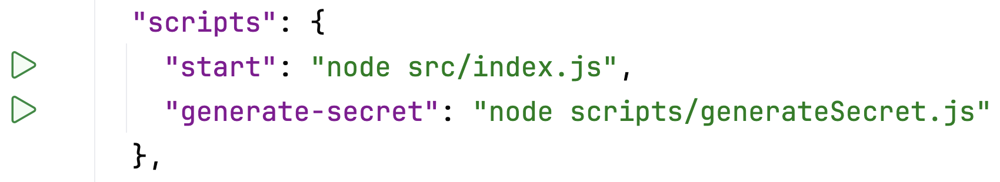

In the previous task, we mentioned that a JSON Web Token is signed using a secret key, which must be kept private.
Now we need to generate this key and think about where to store it.

### Generation
Although almost any string can act as a key, it’s better to use special tools for generating it to ensure the key is strong enough. We’ll use the `crypto` library for this.

### Storing
> **Never store secret keys in variables in your code. Do not upload them to repositories or distribute them with your app's code!**

To store the key separately from the application, while still making it easily accessible during runtime, you can use [environment variables](https://en.wikipedia.org/wiki/Environment_variable). To simplify adding environment variables to the application, we’ll store them in a `.env` file.

> **Do not upload `.env` files to the repository.**

### Task
We will use a small script located in `backend/scripts/generateSecret.js` to generate the key.

It is using `crypto.randomBytes` method. This method takes the key length in bytes as an argument. A 64-byte length will be enough. 
Next, the generated key is transformed into a string format.

Run the script by clicking the  button in the `backend/package.json` file next to `"generate-secret"` script. 

<div style="text-align: center; width:100%; max-width: 600px;">

</div>

You should get the output like this but longer:
```text
MZIuc4b9r4gAQFZxg/ZeDGj+fHPoRWJn4bGRw==
```

Use the generated string as the value of the environment variable `JWT_SECRET` in the `.env` file located in the `backend` directory. 
Make sure you copy all the characters of the key, including, for example, the equal signs at the end.

<style>
img {
  display: inline !important;
}
</style>
