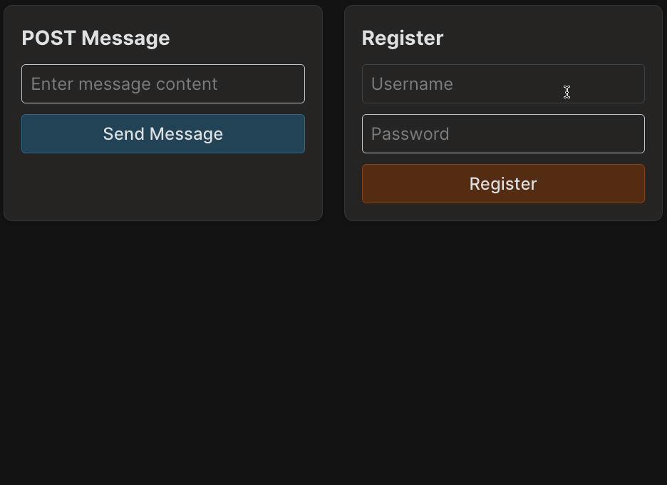

Now no one can send a message without authorization.
Each client sends us a token that encodes their username, but currently, we are still using the username from the request parameters.
This is an extra field that the client has to send, and it also allows setting another user's name.
Let's fix this!

### Task
In the auth middleware `backend/src/middleware/auth.js`, we saved the username from the token in the request: `req.username`.
Since this request is passed to the route handlers after successful authentication, we can now use this field.

Update the POST request handler so that while adding a message, it uses the username from the request (`req.username`) 
that we added earlier in the auth middleware.

Note that the frontend no longer needs the username field. We also updated `backend/__tests__/messages.test.js` file for this.

