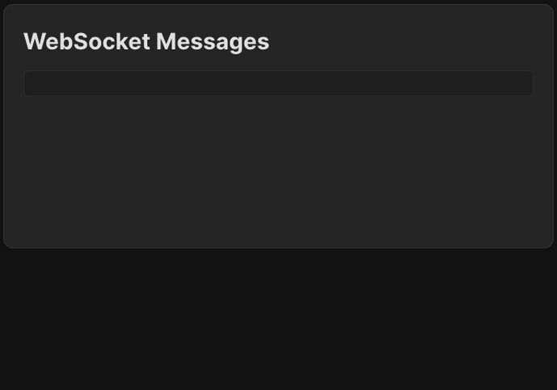

To add support for SQLite database using Sequelize, we only need to make changes in one file: `backend/src/data/dataServices.js`.

---

### Sequelize initialization
First, let's take a brief look at the Sequelize initialization in the `backend/src/data/dbConfig.js` file.
This file contains a small trick: if the project is run in test mode, 
the database will not be saved to disk, and thus the real database will not be used in the tests.

If you're interested in learning a bit more about the implementation, check out the `backend/jest.setup.js` and `backend/package.json` files.
Now let's focus on a non-test scenario.
```js
  const sequelize = new Sequelize({
    dialect: 'sqlite',
    storage: './database.sqlite',
    logging: false
});
```
Since SQLite is a file-based database, we need the path to the database file.
For our example, it will be the current directory, i.e., the `backend` directory in our project.
If you want to see all database operations in logs, you can omit the `logging: false` line.

---

### Creating tables
Now go next to the `backend/src/data/dataServices.js` file.
Here we need to describe how the tables look in the database.
This is necessary both to initialize the tables if the database is empty (on the first run of the application)
and to map the database records to JavaScript objects.

The `Users` table can be imagined like this:

| username | password     |
|----------|--------------|
| TestUser | testpassword |
| Tom      | 12345678     |

Here, `username` and `password` are both of string types (`DataTypes.STRING`) and cannot be empty (`allowNull: false`).
The `username` is a unique field, values cannot be repeated,
and it can be used for an unambiguous search (`primaryKey: true`).

The `Messages` table can look like this:

| id | username | content      |
|----|----------|--------------|
| 1  | Tom      | Hello!       |
| 2  | TestUser | Test message |

The database can completely handle the task of generating unique IDs.

---

### Task
#### Messages table
Complete the `Messages` table initialization with the following fields using the `Users` table as an example:
- `username`: must be of type `DataTypes.STRING` and cannot be `Null`.
- `content`: must be of type `DataTypes.TEXT` and cannot be `Null`.

#### User service
Next, let's update the user service to use a database instead of in-memory storage.

In the `createUser` method:
1. Use the `Users.findByPk` method to find the user by a primary key. Provide the `username` as an argument.
2. Create the user using the `Users.create` method. Provide an argument as a JS object with necessary properties:
   `{ username: <username_value>, password: <password_value> }`

In the `getUser` method:
1. Find the user by a primary key.
2. If the user is found (`findByPk` did not return `null`), return the user object as a plain JS object. Use the `.get({ plain: true })` method for this.
3. If the user is not found, return `undefined` to keep the method interface the same.

#### Message service
In the `addMessage` method:
1. Add a new message using the `Messages.create` method. Provide the following object as an argument:
   `{ username: <username_value>, content: <content_value> }`. Note that we no longer need to generate IDs ourselves; the database will handle it.
2. The `Messages.create` method returns the newly added database record. `addMessage` should return it as a plain object (use the `.get({ plain: true })` method).

In the `getMessages` method:
- Use the `Messages.findAll({raw: true})` async method to retrieve all messages from the database.  
  This ensures you get an array of plain JS objects as a result.

#### deleteMessage (optional)
_This task is optional._  
Completing it doesn’t affect course progress or completion, and it isn’t checked when you click the `Check` button.

Using the [destroy](https://sequelize.org/docs/v7/querying/delete/) method, delete the message with the provided `messageId`.
Return `true` if the message was found and deleted.

---

### Check yourself
That's it! No other changes to the project are required, except for the tests. 
We have updated the tests in `backend/__tests__` directory for you.
You can use them to verify functionality and enjoy a fully working backend by using the frontend.
Now, even restarting the application won't cause the user or message information to be lost.

<div style="text-align: center; max-width: 900px; margin: 0 auto;">

</div>