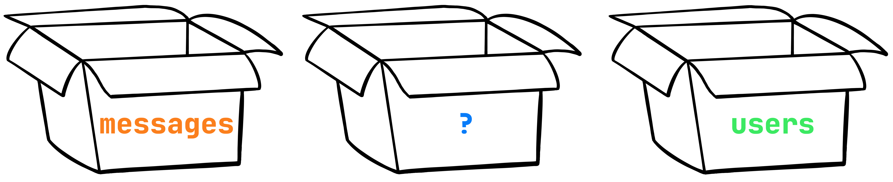

The last preliminary step to the development of a backend is left.
Our chat application, like many others, will be built around the main task: data processing.
And now we need to do the most important thing: decide what data and how we will store.

In this lesson, you will learn how to:
- Design interface for a single way of working with data.
- Implement data layer abstraction.

### What to store
Designing your application, spend some time to make a list: what entities, what datatypes you need in your project. 
It will be much easier for you later and will not spend time coming back to this stage. 

To keep our project simple, we'll only focus on two types of data for now: messages and users. 
But in reality, if you missed something, keep in mind that this can always be added later on.

