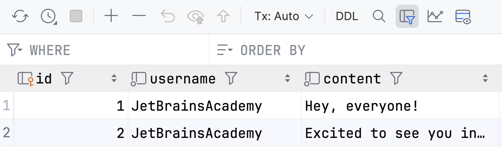

Excellent, now all the data is reliably stored in the database! 
You may have noticed the `database.sqlite` file located in the `backend` directory, 
which contains all our data. But can you take a look inside it?

Of course, you can!
If you ever want to inspect the database contents, you usually have tools for it.

For SQLite, you can use an application like [DB Browser for SQLite](https://sqlitebrowser.org/) or the integrated [Database tool](https://www.jetbrains.com/help/webstorm/settings-tools-database.html) in WebStorm.

Try using one of these tools and explore the contents of the `backend/database.sqlite` file.

