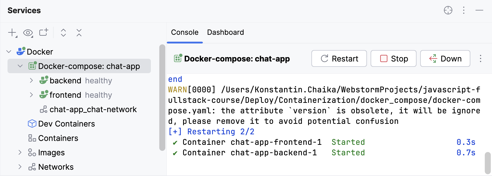

So, we are all set to run both containers with our services.
To make managing them much easier, we will use [Docker Compose](https://docs.docker.com/compose/).

**Docker Compose** is a tool that allows us to define the deployment of multiple containers
and has the added benefit of making each container targetable using the service name.
All we need to do is create a [docker-compose.yaml][docker-compose.yaml] file in our main directory.

### docker-compose.yaml
This file declares two services. Each service will have its own container built and run.
Let’s look at the most important sections used to describe the services.

- `build` specifies the path and name of the Dockerfile used to build the image for the container.
- `environment` lists the environment variables that should be set inside the container.
- `env_file` allows environment variables to be loaded from a file without specifying their values here.
> **Use this approach for secret keys like `JWT_SECRET`.**
> **Also, remember to generate unique `JWT_SECRET` using the script `backend/scripts/generateSecret.js`.**
- `volumes` allows creating persistent storage where data will be saved even if the container restarts.
  For example, the volume `chat-db-data` will store the contents of the `'/app/data'` directory inside the backend container.
- `healthcheck` defines a command whose successful execution will verify the service's health.
- `networks` specifies that our containers will be connected via their own private internal network.
  To access another container within this network, you only need to use the service name.
  That’s why we can use a URL like http://backend:8000 inside the frontend container.
- `ports` allows specifying which port on your machine should be mapped to the container’s port (`Host_Port:Container_Port`).

Note that our application is now only accessible through the frontend,
and the frontend-backend interaction happens via the internal network. 

You can get more information about the Docker Compose in the [official documentation](https://docs.docker.com/compose/).

### Launch the application
To launch both services through the terminal, use the following command:
```shell
docker compose up -d
```
And the following command to stop them:
```shell
docker compose down
```

To launch them in the IDE, click the  button
opposite the `services` in the `docker-compose.yaml` file.
You can see all information about launched services in the [Services](tool_window://Services) toolwindow:

<div style="text-align: center; max-width: 600px; margin: 0 auto;">

</div>

Now you can access the application at http://localhost:3000.

<style>
img {
  display: inline !important;
}
</style>

[docker-compose.yaml]: course://Deploy/Containerization/docker_compose/docker-compose.yaml
