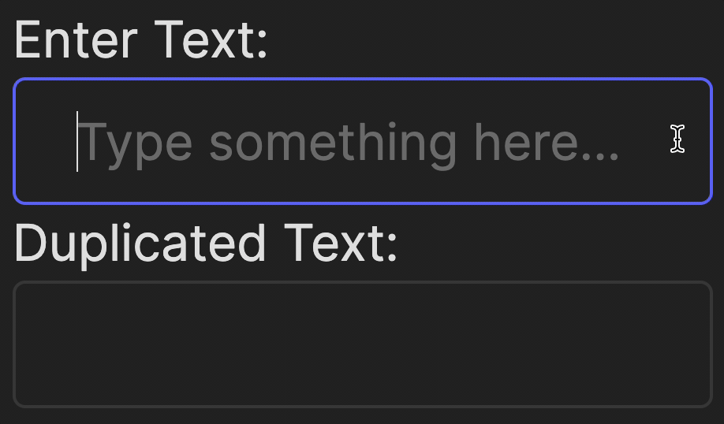
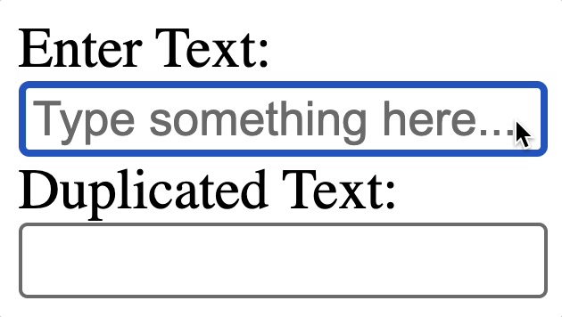

As we already [mentioned](course://Frontend/Introduction/tools_libraries), JSX allows combining HTML, which describes interface components, 
and JavaScript, which defines their behavior, into one file in a way that is convenient for developers.

Let's try to learn more about it, building a simple interactive app where 
anything the user types gets immediately duplicated and displayed below.

Look at the `frontend/src/App.jsx` file. The heart component is the `useState` _hook_ from React. This lets us store and update the value of the text input dynamically.

```js
const [inputValue, setInputValue] = useState("");
```

What is happening here?
- `inputValue` is the state variable that stores the current value of the input field.
- `setInputValue` is the function that allows us to update `inputValue`.
- `useState("")` initializes this state with an empty string.

When a user types into the input field, we need to "listen" and immediately update the state. For this, we define a simple function:

```js
const handleInputChange = (event) => {
    setInputValue(event.target.value);
};
```

Breaking it down:
- Here, `event.target.value` grabs the value the user just typed into the input field.
- `setInputValue` is called to update the `inputValue` state with this new text.

This function is then "attached" to the input field through the `onChange` event.

The code below in the `src/App.jsx` file describes the fields with labels for entering and displaying duplicate text. 
They have quite telling property names, but let's look at some of them in more detail.

- `htmlFor="..."`: this label's property explicitly indicates which field the label belongs to and can be useful when writing tests in the future.
- `value={inputValue}` ensures that whatever users type gets fed into the `inputValue` state.
- `onChange={handleInputChange}` listens for any input changes and updates the state instantly.

Now run the application and check how it works!

<div style="text-align: center; width:60%; max-width: 300px;">

</div>

Here’s the magic: as soon as you type something into the first field, 
React automatically rerenders the second field to reflect the same value. 
This is thanks to the real-time connection between React’s state (`inputValue`) and the UI.


### CSS styles
In this course, we will focus more on what the elements do rather than how they look.
However, the appearance of a web application is just as important. The layout of elements, colors, and other styling can be specified using CSS.
In React applications, there are two ways to apply styles to objects:
- _Traditional method_ using a `.css` files, and the styles are applied to elements using class names.
- _Inline style_ applying styles in your JSX code using the `style` attribute.

You can see both in this project. We are using a `frontend/src/index.css` file and specified some properties just in the `frontend/src/App.jsx` file.

The general rule for choosing a method: styles related to a large number of elements in the application 
that do not require dynamic changes should usually be placed in a `.css` file.  
If you need to change the style of an object according to your application's logic, choose inline style.

To see how much of a difference appearance makes, try commenting out the line `import './index.css'` in the file `frontend/src/main.jsx` and run the application.  
In this case, the styles from `index.css` will not be applied at all.

<div style="text-align: center; width:60%; max-width: 300px;">

</div>