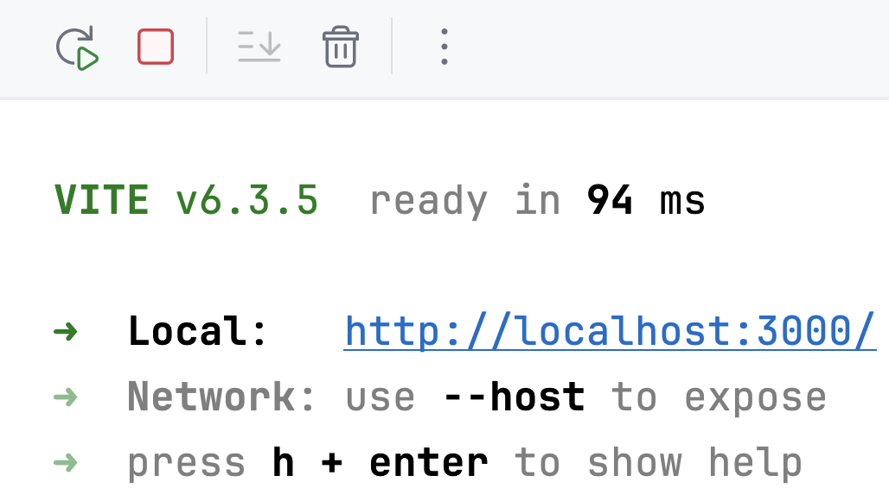

In this lesson, you will learn:
- React project file structure.
- How to create and run a simple React application.

### Frontend file structure
In the task folder you can find the `frontend` folder. For this lesson, we won't even need a backend.

```text
frontend/
├── index.html
├── package.json
├── vite.config.js
└── src/
    ├── main.jsx
    ├── App.jsx
    ├── index.css
    └── assets/
        └── academy.svg
```

We recommend that you take a look at each file to make things a little easier in the future. 
The purpose of these files is as follows:
- `index.html`: The main HTML template for the application, linking to the root React component and setting up the initial page.
- `package.json`: Project configuration file.
- `vite.config.js`: Configuration file for Vite, specifying build and development server settings.
- `src/main.jsx`: Entry point of the React application, rendering the root React component (`App`) into the HTML.
- `src/App.jsx`: The main React component of the application.
- `src/index.css`: The main CSS file providing the application's styling and visual design.
- `src/assets/academy.svg`: An [favicon](https://en.wikipedia.org/wiki/Favicon) of the application.

Most of the changes in this lesson will be made in the `src/App.jsx` file.
We'll talk about it in more detail.

### Running the project
To run this application, open `frontend/package.json` file and click  next to the `start` script in the IDE interface.

You will see an output similar to this:
<div style="text-align: center; width:60%; max-width: 500px;">

</div>

Click on the displayed URL (http://localhost:3000/) to see the `Welcome!` message right in your browser!

🎉 Yay, you've launched your first frontend application.

### Stopping the project
Remember to always stop your application when you're done. Click the  button in the tool window at the bottom of your IDE.

### Making changes
Try to modify the `frontend/src/App.jsx` file: change the text, 
add one more header and see how the changes you make are reflected in the browser.

<style>
img {
  display: inline !important;
}
</style>
