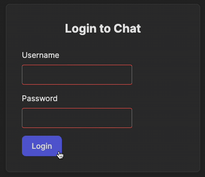

Let's start from the creating pages.   

When making changes to a project, multiple files may be affected simultaneously. 
Therefore, we will clearly indicate which files you should focus on and what to pay attention to.

---

### Login.jsx
Look at the [_frontend/src/pages/Login.jsx_][Login] file.
`Login` here is a _React functional component_ that accepts `onLogin` callback as a property.
On this login page you can find a form with two fields for username and password.

When reviewing the file, note the following:
- Look how easily you can control the components in React: for example `type="password"` means 
that a text in this field will be hided with dots and `required` shows that it's a mandatory field.
- When the Login button is clicked, the `handleSubmit` handler will be called, 
  but since we don't have a connection to the backend yet, we simulate a successful login by calling the `onLogin` callback.
  We'll soon see what this call will affect.

---

### Register.jsx
Look at the [_Register.jsx_][Register] file in the same folder.

- There are three fields here: for the username, for the password, and for the password confirmation.
  The code for comparing the password and confirmation will be added later.
- There is also an `onLogin` callback, which should be invoked in case of successful user registration.

React makes it easy to specify, for example, restrictions such as minimum field length (with `minLength="6"`) but be careful:

> _Any validations and restrictions on the frontend are aimed at improving the user experience and enabling faster checks directly in the browser._
> _This does not prevent the possibility of accessing the API by bypassing the frontend and may not be secure._

> _Critical data, such as ensuring that the user entered a valid email, that the password is not empty or the user is logged in, should not only be checked on the frontend._
> _Always validate such data on the backend as well._

---

### Chat.jsx
Open the [_Chat.jsx_][Chat] file. The most complex page in the future currently looks extremely simple.
The user should access this page already logged in, but let's give them the option to log out.
For this, we have the Logout button and the `onLogout` callback, which will be called when it is pressed.

---

### App.jsx
Finally, the most interesting part awaits us in the [_App.jsx_][App] file. Each `<Route>` describes a page of the application:
which URL it corresponds to and which component represents it.

The callbacks currently don’t do anything, but we’ll add functionality for them along with routing rules in the next task.    

---

### main.jsx
In the [_main.jsx_][main] file we are just using the `BrowserRouter` component to wrap our App in it: 
```jsx
<BrowserRouter>
  <App />
</BrowserRouter>
```

---

### Check it out!
It's finally time to launch our application! As usual, click  next to the `start` script in the [_frontend/package.json_][package] file.
After starting it, navigate to the URLs of our pages to look at our pages:
- http://localhost:3000/login
- http://localhost:3000/register
- http://localhost:3000/chat

Of course, no useful actions occur when clicking the buttons for now,
but you can try entering some data and see how the attributes of the fields we provided work.

Try making some changes and see how the appearance updates. Don’t worry, this will not affect the next task.

<div style="text-align: center; width:60%; max-width: 500px; margin: 0 auto;">

</div>

<style>
img {
  display: inline !important;
}
</style>

[Login]: course://Frontend/Routing/application_pages/frontend/src/pages/Login.jsx
[Chat]: course://Frontend/Routing/application_pages/frontend/src/pages/Chat.jsx
[Register]: course://Frontend/Routing/application_pages/frontend/src/pages/Register.jsx
[App]: course://Frontend/Routing/application_pages/frontend/src/App.jsx
[main]: course://Frontend/Routing/application_pages/frontend/src/main.jsx
[package]: course://Frontend/Routing/application_pages/frontend/package.json
