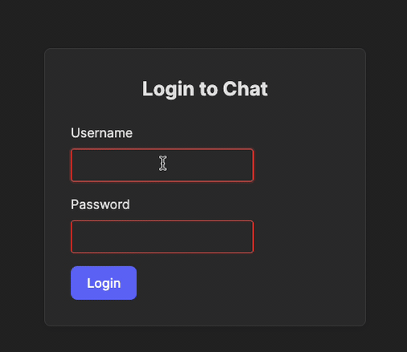

Now let's implement the most interesting part: the routing logic between pages.
Thanks to React, the implementation won't be too difficult.
The main task for the developer here is to design the navigation logic.

To keep things clear, let's draw a graph showing the conditions for automatic page routing.
For our project, such a scheme seems obvious, but for larger ones, it might be essential.

<div style="text-align: center; width:80%; max-width: 500px;margin: 0 auto;">

</div>

### Implementation
Look at the [App.jsx][App] file.

First, we need to create a state variable to indicate whether the user is logged in or not:
```jsx
const [isAuthenticated, setIsAuthenticated] = useState(false);
```

Next, we add a condition to determine which element should be rendered.
Look at the example for the `"/login"` route.
If the user is **not authenticated**, we render the `<Login />` component.
Otherwise, we render the `<Navigate to="/chat" replace />` component, which redirects the user to the `"/chat"` page.

<div class="hint" title="replace">

  The `replace` prop ensures that this navigation does not leave a history entry for the previous path.
  This means the browser’s back button won’t navigate back to the login page.
</div>

Note that for the `<Login />` component, we pass a callback function as a prop. When executed, this function sets  
the `isAuthenticated` variable to `true`. As a result, React will immediately handle routing to the appropriate page.

For convenience, we also added a rule to redirect to the login page from the root URL of the application:
```jsx
<Route path="/" element={<Navigate to="/login" replace />} />
```

### Task
Implement routing rules for the `"/register"` and a `"/chat"` paths. The image above will help you.
- Redirect user from `"/register"` to `"/chat"` if the user is authenticated.
- Redirect user from `"/chat"` to `"/login"` if the user is **not** authenticated.

Remember to provide `onLogin` and `onLogout` callbacks to the `<Register />` and `<Chat />` components respectively.

### Check yourself
Run the application and try to navigate to its pages starting from http://localhost:3000/login or 
http://localhost:3000/register URLs.

You can also check out tests from the [\_\_tests\_\_/routing_test.jsx][routing_test] file for self-checking 
or to see how they are organized. 
Note that as long as we don't have a connection to the backend, the tests are organized quite simply.

<div style="text-align: center; width:100%; max-width: 450px;margin: 0 auto;">

</div>

[App]: course://Frontend/Routing/routing_implementation/frontend/src/App.jsx
[routing_test]: course://Frontend/Routing/routing_implementation/frontend/__tests__/routing_test.jsx
