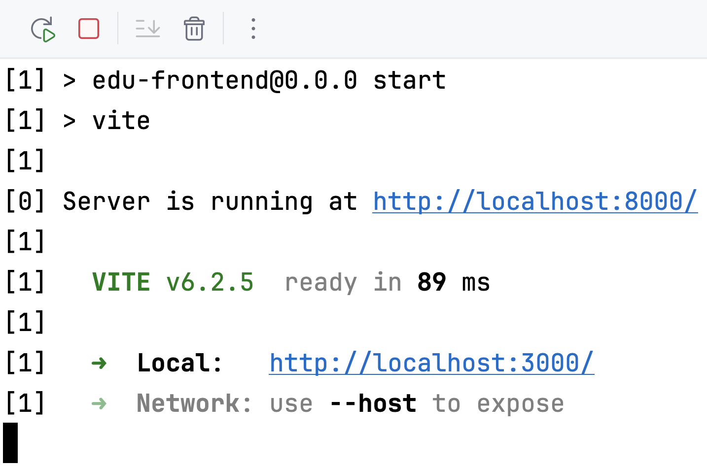
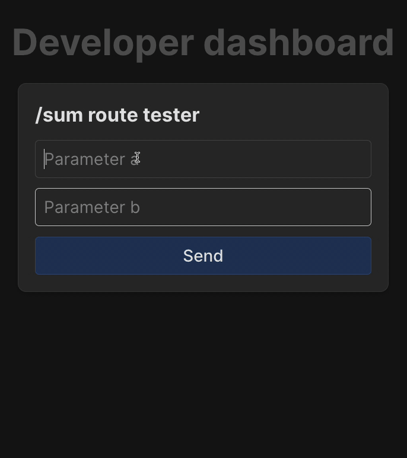

You probably thought in the last step that debugging your backend app using a browser is extremely inconvenient, and indeed, nobody usually does that.

Developers use plenty of tools for these tasks, allowing you to send a wide variety of HTTP, REST, and other requests. 
For example, [Postman](https://www.postman.com/), open-source [HTTPie](https://httpie.io) or the integrated [HTTP Client](https://www.jetbrains.com/help/webstorm/http-client-in-product-code-editor.html) in WebStorm.

This course will not overwhelm you with this information and provides an educational frontend 
that allows you to test the application you are developing until you write your own frontend.

### Updated project structure
Our project has changed its structure again, which we will follow until the end of the course. 

Now we have two top-level directories: _backend_ and _frontend_.  
Each of them has its own **package.json**, which is responsible for the part of the project where it is located, and a common **package.json**, which allows us to launch the whole project.

```text
.
├── backend 
│   ├── package.json  // backend configuration file
│   └── src
│       └── index.js
├── frontend
│   ├── ...
│   ├── package.json  // frontend configuration file 
│   └── ...
└── package.json      // common configuration file
```

If you're curious, you can look at how the frontend is designed in each task, but for the first part of the course, you don't even have to look there if you'd prefer not to get distracted.

### Launching the entire project
As usual, click the  button next to the start script in the **top-level** **package.json** to start both backend and frontend.

```json
"start": "concurrently \"cd backend && npm start\" \"cd frontend && npm start\""
```

Now in the terminal you will see output from both backend (starting with `[0]`) and frontend (starting with `[1]`).

<div style="text-align: center; width:60%; max-width: 500px;">

</div>

⚠️ **Note:** the backend is still available to you as before on port `8000`, but to open the frontend, use a different URL: http://localhost:3000/.

### Play with it!

Experiment with the frontend. You have a form for entering values and a `Send` button, which calls your implemented route `/sum` with the specified parameters.

Try to make changes to the backend in the current task (now it has pulled in your solution from the previous task). 
Remember to restart the application after making changes.

<div style="text-align: center; width:50%; max-width: 400px;">

</div>

We're good! Our backend works with the frontend!

<style>
img {
  display: inline !important;
}
</style>