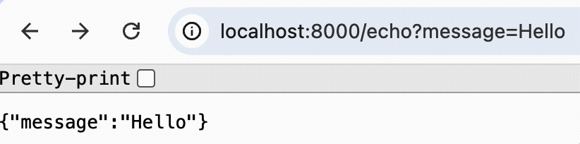

Okay, we've learned how to add new routers, but they're completely non-interactive. We need to fix that!

### Query parameters
The client, be it a web-browser or the frontend of our application, can send different data with the request,
and the easiest way to do this in a `GET` request is to use _query parameters_.
These parameters are specified directly in the URL after the `?` symbol in the following format:

```html
http://localhost:8000/any?param1=value1&param2=value2
```

Consider a `/echo` route that expects to receive some message in the `message` query parameter:
```html
http://localhost:8000/echo?message=Hello
```

You can access the parameters with `req.query.<parameter_name>` expression:

```js
const message = req.query.message;
```

The parameter may be accidentally missing, so always check the value you got is not `undefined`.

### JSON response
As a response, it would be convenient for us to also send a pair: name and value,
especially if we need to work with several values at once.
The easiest way to handle it is using [JSON](https://en.wikipedia.org/wiki/JSON) format. It's very similar to the JavaScript objects format.

Using it, you can send a response by explicitly specifying key-value pairs and status code:
```js
res.status(400).json({message: 'No message provided'});
```

Or just use a more compact way if the variable name is the same as the desired key name:
```js
res.json({message});
```

What is equal to:
```js
res.status(200).json({'message': '<message_variable_value>'});
```

Note that we don't need anymore to call `.type` method because `.json` automatically set the type to `'application/json'`.

### Play with it!
We recommend that you run the application and try passing different values of the message parameter
(or not passing it at all) and see the response.

For example:
- http://localhost:8000/echo?message=Hello
- http://localhost:8000/echo?message1=Hello
- http://localhost:8000/echo

<div style="max-width:600px;">

</div>
