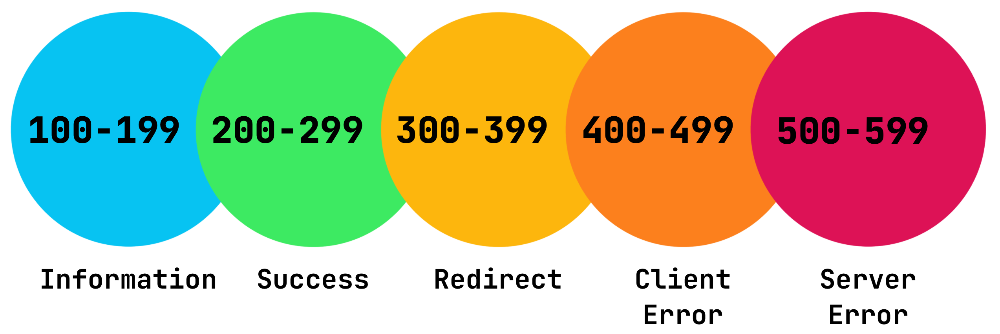
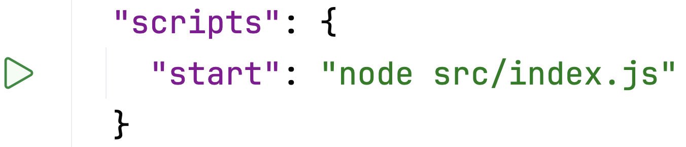
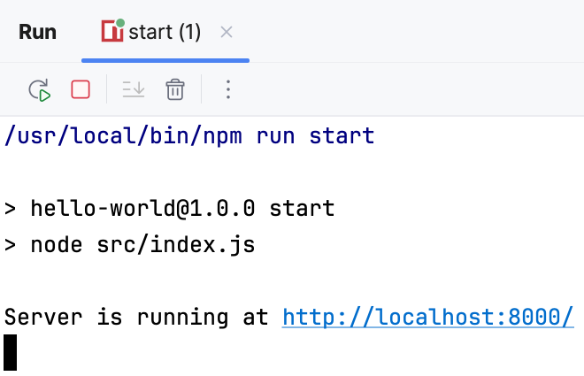

Let's look at the simplest Node.js project. 

```text
.
├── package.json  // project configuration file
└── src
   └── index.js   // main file 
```
It consists of only two files: project configuration file, 
which obviously contains all the information about the project and so far only one source code file.

---
### index.js
This file is where all the magic of web development happens.

First, we create an HTTP server using the `createServer` method and specify a handler function for all incoming requests.
Its job is to process each new request `req` and respond to it with a response `res`.

In our example, the function checks which [URL](https://en.wikipedia.org/wiki/URL) (Uniform Resource Locator) the request goes to.
For _route_ `/` (let's call this path of the URL a _route_) the response header is filled in with the code `200` and the response content type is specified.
Then a text message `Hello, World!` is added to the response.

In case of any other URLs, the server returns the message `Page Not Found` with the code `404`.

<div style="text-align: center; width:80%; margin: 0 auto; max-width: 900px;">

</div>

HTTP response status codes allow the server to very briefly and conveniently report the result of request processing.
The codes are standardized so, for example, code `200` means `OK` and 404 means `Not Found`. You don't even need words 🙂.

You can read more about response status codes in [documentation](https://developer.mozilla.org/en-US/docs/Web/HTTP/Reference/Status).

```js
httpServer.listen(PORT, () => {
    console.log(`Server is running at http://localhost:${PORT}/`);
});
```

Then the server starts on port `8000` and prints a message about it to the screen.

---
### package.json 
This file serves as the central place to manage a Node.js application's setup, tools, and dependencies (libraries/modules) required for the project.

Look through the [package.json](file://GettingStartedNode/hello_world/package.json) in this task. 
The field names are quite meaningful there so you shouldn't get confused.

The most important section for us right now is `scripts`.
<div style="text-align: center; width:60%; max-width: 500px;">

</div>

Here we can define specific commands for our Node.js project. This is most often used to run a project, run tests or install dependencies in projects with a complex structure.

---
### Running the project
To run this application, click  next to the `start` script in the IDE interface. The same can be done in the terminal with command `npm start`.

You will see the similar output:
<div style="text-align: center; width:60%; max-width: 500px;">

</div>

After you can click the URL showed to you (http://localhost:8000/) to see `Hello, World!` message right in your browser! 
Also try to check any other URL like http://localhost:8000/any to see `Page Not Found` message.

🎉 Yay, we wrote our first web application. It has a backend that can serve requests from our browser. Doesn't look too hard, right?

### Stopping the project
Remember to always stop your application. Click  button for it or press `^C` (Ctrl+C).

<style>
img {
  display: inline !important;
}
</style>