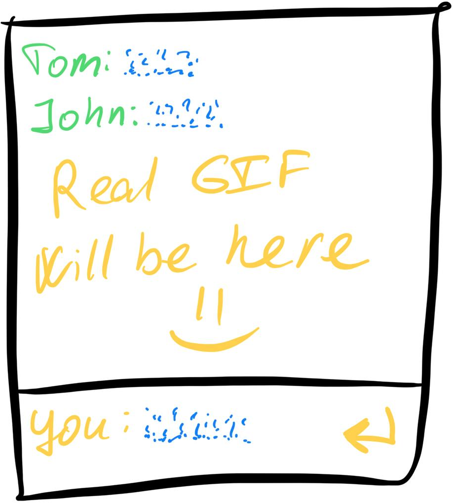

This course is perfect for anyone with a little programming experience who
wants to learn how to write web applications but doesn't know where to start.

### What you’ll build
Step by step, you will create your own **Real-Time Chat Application** with the following features:
  - User **authorization**
  - Live, instant **message updates**
  - A simple, shared chatroom for all users

You can add this project to your portfolio, show it to your friends, 
or use it as inspiration to create something entirely new and different!

### What you'll Learn
By completing small but meaningful tasks, you will gain the following technical skills:
- Setting up the **server** and **browser** components of a web application
- Basics of **real-time communication** (e.g., WebSockets)
- User authentication and message handling
- Key aspects of deployment and project structuring
- Backend: Create a backend app with Node.js and Express.js with structured routing
- Backend: Log and debug the app, handle errors
- Backend: Store data in a database or an alternative data layer
- Backend: Use Socket.IO for real-time data exchange
- Backend: Implement simple JWT authentication

### Course style
We don't want to overwhelm you with routine programming tasks.
In this course, you'll encounter minimal coding, but it will cover **all stages** of web app development.

You'll get only the essential theory, links to in-depth resources, and practical tasks — nothing unnecessary.

# TODO: update this file before release