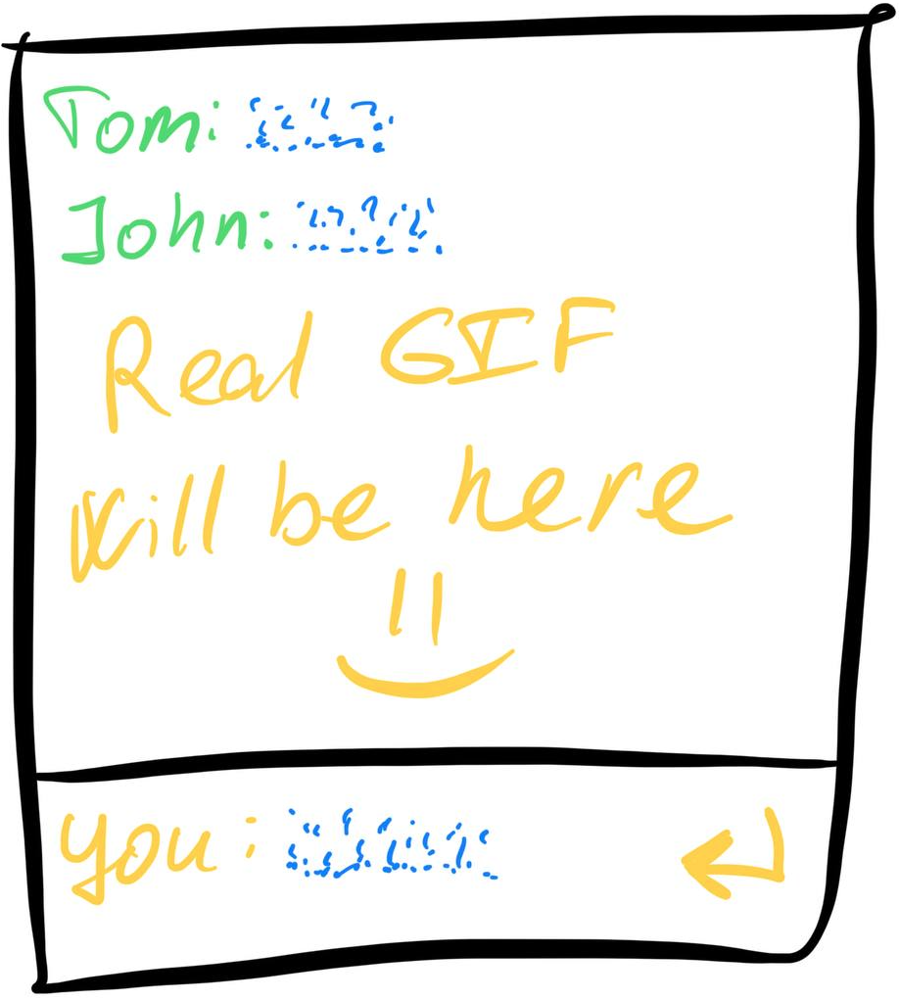

This course is perfect for those who already have a little programming experience and
want to learn how to write web applications, but don't know where to start.

### What you’ll build
You will step-by-step implement your own **Real-Time Chat Application** with:
  - User **authorization**.
  - Live, instant **message updates**.
  - A simple, shared chatroom for all users.

Add it in your portfolio, show to your friend or create something of your own, absolutely different from this project.

### What you'll Learn
Completing small but meaningful tasks, you will get the following technical skills:
- Setting up the **server** and **browser** parts of a web application.
- Basics of **real-time communication** (e.g., WebSockets).
- User authentication and message handling.
- Key aspects of deployment and project structure.
- Backend: Create a backend app with Node.js Express.js, routers
- Backend: Log and debug this app, handle errors in it
- Backend: Store data in the data layer with DB or not
- Backend: Use Socket.IO for real-time data exchange
- Backend: Implement simplest JWT authentication

### Course style
We don't want to overwhelm you with routine programming tasks. 
In this course, you'll get a minimum of coding, but it will cover **all stages** of web-app development.

Only the minimum required amount of theory, links to detailed resources, tasks for practice and nothing else extraneous.

# TODO: update this file before release