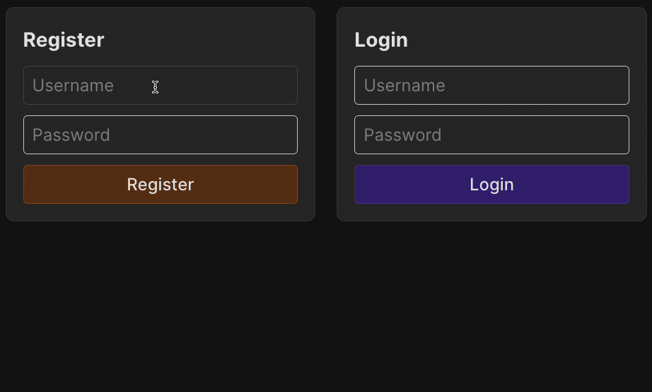

We’ve implemented routes for working with messages, and now it’s time for authentication.
The authorization middleware for all routes will be added later, 
for now, let’s make a preparation: implement routes for user registration and login.

### Task
To complete the task, you will need to modify three things.

#### index.js
Before starting work on the file `backend/src/routes/auth.js`, pay attention to `backend/src/index.js`.

Add an authentication router to handle the route `'/api/auth'`. Remember to import it from `'./routes/auth.js'`.  
This means that all requests to routes starting with `'/api/auth'` will be directed to the auth router.  
As a result, the full URLs for registration and login in the app will be `'/api/auth/register'` and `'/api/auth/login'`.

#### Registration route
The purpose of this route is to add a new user to the user service. Follow these steps:
1. Get the `username` and `password` parameters from the `req.body`.
2. If one or both parameters are missing, return a JSON response `{ message: 'Username and password are required' }` with the status code `400` (Bad Request).
3. Next, note the line for getting a hashed password. You can read more about the `bcrypt.hash` method on the [bcrypt package page](https://www.npmjs.com/package/bcrypt).
4. Create the user using the method `userService.createUser`.
5. If the user is successfully created, return a JSON response `{ username: <username_value> }` with the status code `201`.

#### Login route
The purpose of this route is to verify that a user with the specified username and password is registered in our application.  
For now, this route will only indicate in the response whether such a user exists.  
Follow these steps:
1. Get the `username` and `password` parameters from the `req.body`.
2. If one or both parameters are missing, return a JSON response `{ message: 'Username and password are required' }` with the status code `400` (Bad Request).
3. Get the user by `username` from the user service.
4. If the user is not found, return a JSON response `{ message: 'Invalid username or password' }` with the status code `401`.
5. Compare the password from the request body with the hashed password from the user service for this user.  
   Use the method `bcrypt.compare`, which takes the plain password as the first argument and the hashed password as the second: `bcrypt.compare(plaintextPassword, hashedPassword)`.  
   It returns `true` if the passwords match.
6. If the passwords do not match, return a JSON response `{ message: 'Invalid username or password' }` with the status code `401`.
7. If the user is successfully authenticated, return a JSON response `{ username: <username_value> }` with the status code `200`.

#### Check yourself
As always, you have access to public tests in the `backend/__test__/auth.test.js` file and frontend to test your routes.  
Use them to better understand how to complete the task or to check that everything works as expected.

