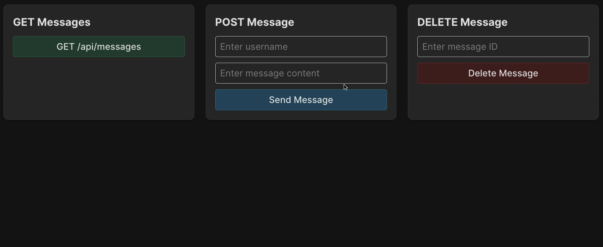

You can see opened `backend/src/routes/messages.js` file in which `router` is already declared. 
It already has several handlers for GET, POST and DELETE requests that we need to implement to support the messages API.

Before we return to this file, let's see how easily this router is added to our application in the file `backend/src/index.js`. 
There you only need to import the router and add it using the familiar `app.use` method:
```js
app.use('/api/messages', messageRoutes);
```

Also note the URL `'/api/messages'`. 
This means our `messageRoutes` router will actually handle GET, POST, and DELETE requests for this route.

---

### Task

Complete the implementation of message processing routes. Remember to use `await` keyword using `messageService` methods since they are asynchronous. 

Note that each route has its own try-catch block.  
This helps isolate error handling, ensuring the proper response status codes and custom error messages for different operations.

#### GET
Get messages from `messageService` and send them as a response using the `res.json()` method.

#### POST
[POST](https://en.wikipedia.org/wiki/POST_(HTTP)) request assumes that the server accepts the data enclosed in the body of the request message.

In our case, the request body contains two fields with the message text and username:
```
req.body.content
req.body.username
```

Add a check for the presence of the `content` parameter in the request body, similar to `username`. Response with message `'Message content is required'` and code `400` in case of error.

Then, add the message to `messageService`.
The `addMessage` method you will use returns an object containing the fields `id`, `username`, and `content`.
Use this object as the handler's response. Set the response status code to `201`, which means `Created`.

### Check yourself
For self-testing and debugging, you have tests available in the `backend/__test__/messages.test.js` file, as well as the frontend,
which allows you to experience how just a few lines of code bring you closer to a working application.

<div style="text-align: center; max-width: 900px; margin: 0 auto;">

</div>

---

#### DELETE (optional)
This task is not checked when clicking the `Check` button and does not affect course completion.

To delete a message, you will need to:
- Get its `id` from the route parameters: `req.params.id`.
- Perform deletion using `messageService`.
- If the message was not found, return the `404` code with the body `{ message: 'Message not found' }`.
- In case of successful deletion, set the response code to `204` (`No Content`): `res.status(204).send()`.

Remember to change test cases declaration from `xit` to `it` to make them works in the `backend/__test__/messages.test.js` file. 

<div class="hint" title="Route parameters">

[Earlier](course://GettingStartedExpress/sum_route_implementation) in the course, we used query parameters:
```text
/some_route?id=value
```
And later in the code, we could use this parameter as follows:
```js
req.query.id
```

But there is another way, where the value is part of the URL:
```text
/some_route/value
```
To use this method, you first need to specify a placeholder when declaring the handler (`'/:id'`) in this case.
This will allow you to access the passed value using the name specified in the placeholder:
```js
req.params.id
```  
</div>
