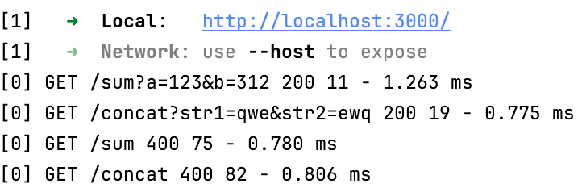

Now it's time to add logger middleware to our project. It can be very handy later.

### Task
Add the [morgan](https://expressjs.com/en/resources/middleware/morgan.html) logging middleware to the project.

This can be done in three simple steps. After doing it, run the application, 
use different routes with education frontend or without, and look at the output.

<div style="text-align: center; width:80%; max-width: 700px;">

</div>

#### 1. Import 
Add import at the beginning of the file.
```js
import morgan from "morgan";
```

#### 2. Usage
Add the middleware to the application.
```js
app.use(morgan('tiny'));
```

#### 3. Dependencies
In a real project, you should also add libraries into `package.json`. In this task, we've already done it for you:
```json
  "dependencies": {
    ...,
    "morgan": "^1.10.0"
  }
```
