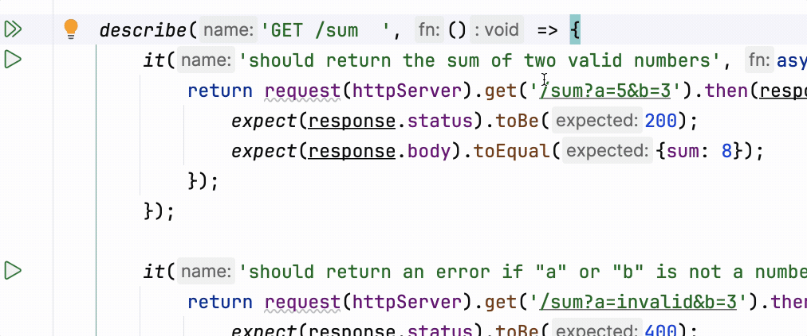

If tests are so useful, let's add them to our project! It only required a couple of changes.

### Test file
In the `backend/__tests__/sum.test.js` file you can find 
test description for the `/sum` route created in the previous lesson.

At the beginning of the file, you can find two imports:
- The `request` from `supertest` library, which is used to make HTTP requests to our application's server for testing purposes.
- The `httpServer` object that will be tested from our application. 
  That's why we added `export { httpServer }` to the end of `index.js`.

Next, you can find some special methods that may be useful later. 
Right now, for example, the `afterAll` method allows us to automatically terminate our web application after testing. 
Since it automatically runs after the `httpServer` import is done, we shouldn't run it explicitly.

And below that there is a nested test suite for testing the `GET /sum` endpoint:
```
describe('GET /sum', () => { ... });
```

Where each suitcase is described like this:
```
it('should return the sum of two valid numbers', async () => { ... });
```

---

### Running tests
You can run all tests at once just clicking the  button opposite the `describe` block or 
run specific test with  button opposite the `it` block.

You will see the output of the tests in the toolwindow at the bottom, 
and next to each test you will see a  or  icon depending on whether the test is passed or failed. 

__Try breaking the `/sum` handler and see how the tests behave!__

<div style="text-align: center; width:100%; max-width: 700px;">

</div>

---

### Project configuration file
As you may have noticed, everything already works as it is. 
So this optional step only adds convenience and the ability to automate test launching even without IDE.

Look at the `backend/package.json` file. In addition to the new dependencies, the `jest` block has been added there:
```json
  "jest": {
    "testEnvironment": "node",
    "testMatch": ["<rootDir>/__tests__/**/*.test.js"]
  }
```


<a href="https://jestjs.io/">Jest</a> is a testing framework for JavaScript. 
Running tests as it shown above, we already used it.  

In the `backend/package.json` we can specify for the whole project which files should be considered as test files and 
run all tests for the whole project at once by clicking the  button.

<div class="hint" title="Path patterns">

  You may notice that the path to the test files in the example above is specified as a template `"<rootDir>/__tests__/**/*.test.js"`.
  It should be read as follows:
  - `<rootDir>` — refers to the root directory of the project this `package.json` file is located.
  - `__tests__` — folder name.
  - `**/` — matches any number of intermediate nested directories.
  - `*.test.js` — matches all files with `.test.js` extension.
</div>


<div class="hint" title="Running tests with CLI">

  If you want to run the tests manually in the terminal, execute in the `backend` directory the following command:
  ```shell
  NODE_OPTIONS="--experimental-vm-modules" npx jest
  ```
  Parameter `--experimental-vm-modules` is [important](https://jestjs.io/docs/ecmascript-modules) for Jest to work with a Node.js project.
  Using the IDE's graphical interface in this course, you don't have to think about it. We set everything up for you. 
</div>

---

### Tests in this course tasks
As you already know, there are auto-checking tasks in this course. 
Under the hood, they are implemented in almost the same way, but the source code is hidden from you.

To immerse you in the atmosphere of real development, in the future, 
most of the tests will be duplicated to you in the `__tests__` directory, 
and you can always take a look at them and run them by hand if you want.

<style>
img {
  display: inline !important;
}
</style>
