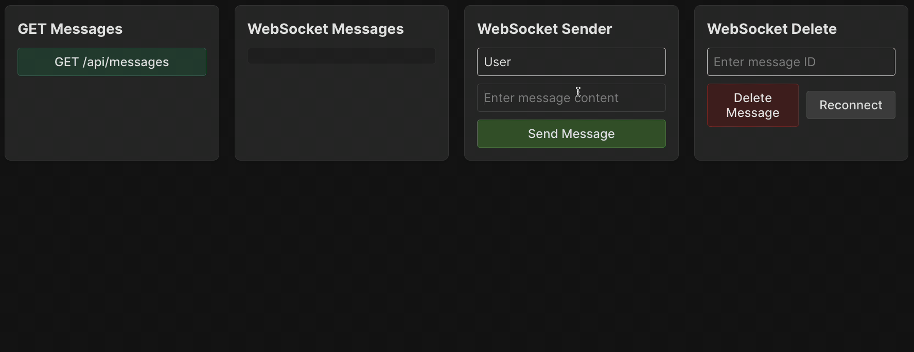

To implement real-time message delivery, we will use the [Socket.IO](https://socket.io/) library.
In fact, it does not always use WebSocket inside, but we don't need to dive into the details of its implementation.

### Socket.IO
From the [previous task](course://WebSockets/lesson_overview), we know that a WebSocket connection can be established between clients and the server. 
For each client, the server creates a `socket` object representing this connection.
But how is communication carried out between the client and the server within the socket?

For this, an _events_ mechanism is used.
Events can be thought of as _messages_ with an associated name (_event name_).
These events are defined on both the server and the client, facilitating seamless real-time communication.
The server can receive such event messages from its clients, send messages back to a single client, or broadcast them to all clients.

Thus, our primary task now will be the implementation of event handlers.
In this task, we will use both built-in event names and our own.
- **Built-in events**
  - `connection`: triggered when a new client successfully connects to the server, allowing the server to set up communication with this client.
  - `disconnect`: triggered when a client disconnects from the server, either intentionally (e.g., closing the browser) or due to a connection issue.
  - `error`: triggered when something goes wrong, such as connection issues or unexpected problems.
- **Custom events**
  - `message`: triggered when a new message appears. That is, the client sends a new message to the server, or the server broadcasts it to all connected clients.
  - `deleteMessage`: triggered when a client requests the deletion of a specific message.
  - `messageDeleted`: the server broadcasts this event to all connected clients to notify them that a message has been deleted.

To keep the structure of our project simple,
we have moved the initialization of all event handlers to a separate function `initializeSocketIO` in the file `backend/src/socket.js`.

Use the `socket.on` or `io.on` methods to add event handler for a specific socket or all connections respectively.
The methods `socket.emit` and `io.emit` allow sending event messages to a specific socket or broadcasting them to all connected clients.

### Task
Carefully review the contents of the file `backend/src/socket.js` and pay attention to the event handlers in this file.

#### `message` event
Implement the handler for processing new messages. To do this:
1. Extract `username` and `content` from the `data` object. It contains the message payload.
2. Add the new message using the message service.
3. Send the message returned by the `addMessage` method to all connected clients using the `io.emit` method with the same event name, `message`.

#### index.js
Now let's move to the file `backend/src/index.js`.  
In it, we need to create a SocketIO object like this:
```
const io = new SocketIO(httpServer);
```
and pass it to the `initializeSocketIO` function.

### Check yourself
As always, when completing a task, you can rely on the tests available in the file `backend/__tests__/socket.test.js`.
Also, on the frontend, you have elements available for sending, deleting, and receiving real-time messages.

Note that since all data handling is performed through the data layer, the `'/api/messages'` route always returns the latest list of messages.

<div style="text-align: center; max-width: 900px; margin: 0 auto;">

</div>

#### `deleteMessage` and `messageDeleted` events (optional)
This task is optional and will not be checked when clicking the `Check` button, so it does not affect course completion.

Implement the handler for deleting a message. To do this:
1. Extract `messageId` from the `data` object.
2. Delete the message using the message service.
3. If there is no message with such ID, send the message `{ message: 'Message not found' }` in the `'error'` event to the current socket and return from the handler method.
4. If successful, send `{ messageId }` in the `'messageDeleted'` event to all connected clients (`io.emit`).
